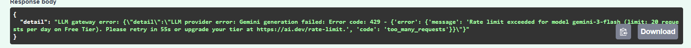
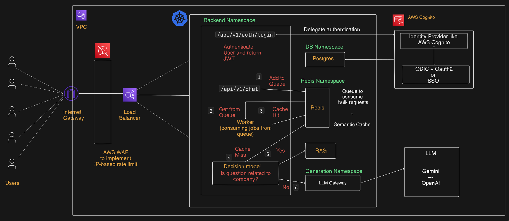
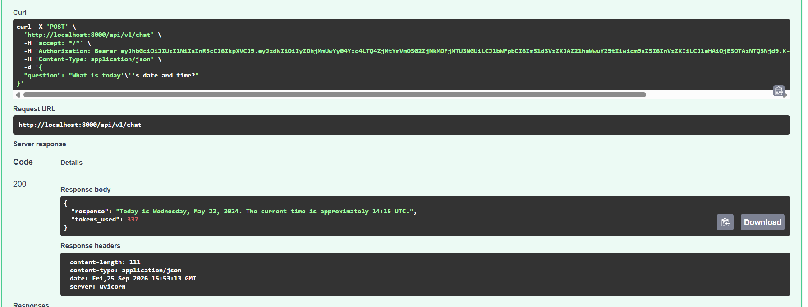
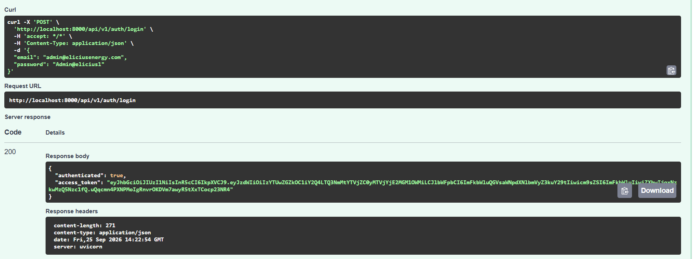
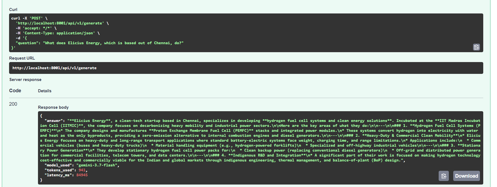
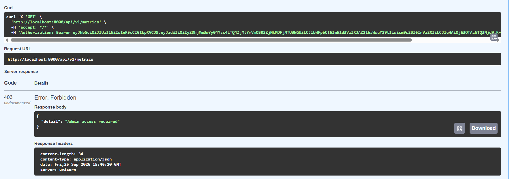
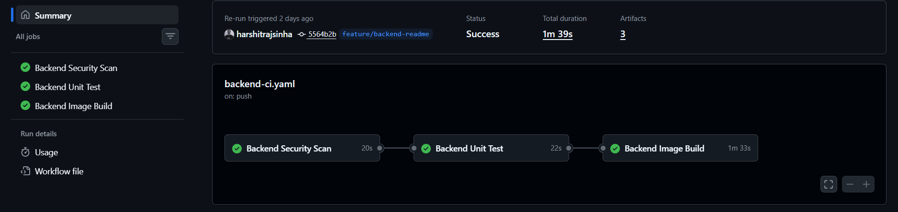

[Video Explaination](https://youtu.be/cI5E9cI-Q2s)

This project follows single server monolithic architecture containing 3 services -
1. `Backend`: QnA API service that authenticate users and exposes `/chat` endpoint.
Refer: [Backend Service](./backend/README.md)
2. `Generation`: Upstream service that `/chat` calls in order to get response from AI model.
Refer: [Generation Service](./generation/README.md)
3. `Postgres`: To store user information in "users" table

run and managed by docker containers via `docker compose`

## Setup Instruction

1. Create `.env` file in root directory by referring to `.env.example`

2. Build images by running `docker compose --env-file .env build`

3. Start all the services by running `docker compose --env-file .env up`

## API routes

QnA API (Backend) service

| Method | Path | Purpose |
| --- | --- | --- |
| `GET` | `/api/v1/health` | Returns the service health status. |
| `GET` | `/api/v1/metrics` | Returns request count, error count, and average latency for tracked endpoints. |
| `POST` | `/api/v1/chat` | Forwards chat requests to the LLM gateway and returns AI-generated responses. |
| `POST` | `/api/v1/auth/login` | Validates an email and password against a user in PostgreSQL. |


LLM Gateway (Generation) service

| Method | Path | Purpose |
| --- | --- | --- |
| `GET` | `/api/v1/health` | Returns the service health status. |
| `GET` | `/api/v1/metrics` | Returns request count, error count, and average latency for the requests received by LLM provider. |
| `POST` | `/api/v1/generation` | Receives request from downstream API and sends to AI provider like Gemini or OpenAI. |

## Limitations of current architecture

* **Monolithic**: Deployment and scaling of one service depends on other. Development is tightly coupled.
* **Single-server**: Current architecture can be run in a single server through docker containers but this becomes a single point of failure. If server fails entire application would go down.
* **Login through Email/Password**: Email-password login pose a security risk and maintenance overhead for the developers as well as for users to remember the password.
* **High request volume**: Current architecture would hit rate limit from LLM provider if too many requests are sent.
<br><br>


## Enterprise level architecture



TODO: Explain architecture decisions


## 2. Authentication and Authorization

* The current email/password login flow has limitations as it requires the application to directly manage and store user credentials and users to remember their passwords. 

* This is why the current authentication flow should be extended to SSO/OAuth2 so that we can delegate authentication responsibility to identity providers who implement robust security practices like - Google OAuth2, AWS Cognito, or Okta.

* In order to extend this we would require a migration strategy for existing users where we during the migration phase we would allow users to sign-in via their credentials and simultaneously create their accounts on decided SSO or OAuth2 authentication syste.

* We could even alert the users of this migration strategy through email. Once the migration period is over we will eliminate the email and password and allow users to login via new authentication system.
<br>

```
CURRENT LOGIN FLOW                     PROPOSED SSO/OAUTH2 FLOW
┌──────────────────────┐             ┌──────────────────────┐
│ User                 │             │ User                 │
│ (email + password)   │             │ (SSO Login)          │
└──────────┬───────────┘             └──────────┬───────────┘
           │                                     │
           ▼                                     ▼
┌──────────────────────┐             ┌──────────────────────┐
│ Backend App          │             │ Identity Provider    │
│ - Validates password │             │ - Manages auth       │
│ - Checks database    │             │ - MFA support        │
│ - Creates JWT        │             │ - User directory     │
└──────────┬───────────┘             └──────────┬───────────┘
           │                                     │
           ▼                                     ▼
┌──────────────────────┐             ┌──────────────────────┐
│ Database             │             │ Backend App          │
│ - Stores passwords   │             │ - Validates token    │
│ - User records       │             │ - Creates JWT        │
└──────────────────────┘             └──────────┬───────────┘
                                                │
                                                ▼
                                        ┌──────────────────────┐
                                        │ JWT Token            │
                                        │ - User claims        │
                                        │ - Role/permissions   │
                                        └──────────────────────┘
```


## 4. Scaling Scenario

```
100 req/sec -> Load balancer -> Auto-scaler (can current infra handle this request? Yes) -> "X" Fast API instances -> Distributed caching -> LLM Provider

500 req/sec -> Load balancer -> Auto-scaler (can current infra handle this request? Yes) -> "X+Y" Fast API instances -> Distributed caching -> LLM Provider
```

**Load Balancer** - Intially we could have a single load balancer distributing traffic across multiple FastAPI instances. As the traffic start to grow, even the load balancer would be under load and there we could opt for multiple load balancer and a universal load balancer distributing traffic based on regions.

**Auto Scaling** - If application is running on Kubernetes, we could use Horizontal pod autoscaler that would increase the number of pods based on the resource utilization in order to handle multiple requests.

**Redis** - For caching the responses we need distributed caching strategy through Redis such that all the instances would make cache hit and cache miss from same service. This service could have multiple instances in order to balance the load.

**LLM Provider** - The main bottleneck is likely the LLM providerI. The provider may impose RPM, TPM, and concurrency limits, so even if the application can receive 500 RPS, it may not be able to send 500 LLM requests per second. Async FastAPI requests could handle many concurrent requests, but need to implement a `queue` system to have a controlled concurrency limit. We must `rate-limit` requests from same IP and serve responses from semantic caching.

## 5. Architecture and migration

We can refer the same architecture - `Enterprise level architecture` in order to answer following questions

#### Scaling the application: Using horizontal + vertical scaling

* Why should we go for scaling? - As application runs on a single server it creates a single point of failure and limits the number of concurrent requests. I would approach scaling in following order -

1. Start with `horizontal scaling` single server and add more no of server over vertical. This would primarily `remove single point of failure`, behind a load balancer.
2. We can then `scale vertically` to avoid lots of servers to maintain.
3. For further scaling, we can then opt for `AWS ECS` that would automatically manage the docker containers at large scale.
4. Enterprise level scaling is generally maitained by service like `Kubernetes` especially because of its flexibility with deployment and ability to achieve zero-downtime deployment.

#### Handling LLM API limits: Using Queue system

* There could be chances that the application is receiving 100 req/sec but the upstream LLM API has rate limit of 30 req/sec. In such a case we cannot send all 100 req at once to LLM but cannot reject the requests as well.

* We can solve this by introducing a queue system that would store the incoming requests. A worker would do the job of pulling the requests from the queue at its own pace like 30 req/sec, process it, send the response and then look for next set of requests. In this way we could save from LLM rate limit but also not throw users any error.

#### Handling slow LLM requests: Using retry and fallback

* There could be days when the upstream AI provider is slow and taking time to response. In such a case the requests already in the queue would start to timeout. In order to resolve it we could approach it in following ways -

1. We should primarily check the cache if user's question matches any semantic vectors and respond from the cache than going for AI model.
2. Retry user's request with different AI model since user is abstracted from the model.
3. Fallback - Send relevant error message like - "We are currently facing high demand" if request times out.

#### Monitoring

* `/metrics` - We could use Prometheus to scrape data from `/metrics` endpoint and then display on Grafana.
* We can also use different operators to monitor pod and service health if the application is deployed using Kubernetes.
* Logs - We could collect logs separately in order to monitor application level errors.

#### Managing secrets and configuration

* We must classify configuration as sensitive and non-sensitive and then act based on that. If we are on current single-server architecture then to manage non-sensitive configs like type of environment, application port we could use `.env` or config files. For managing secrets we should opt for secret management tool like `AWS Secret manager` or `Hashicorp Vault` and inject secrets to the application at runtime. For build time secrets we should use docker `Build Secrets` but also ensure that we are using multi-stage builds so that once the build is created and secret is injected to application like React, it gets discarded.

## CICD workflow

* The project also contains a GitHub Action based CICD workflow
1. Trigger & scope: The pipeline runs on pushes to main, feature/**, hotfix/**, and bugfix/**, and on PRs targeting main, test, or dev, but only when backend-related files change.
2. Security scanning: The security-check job checks the codebase for secrets using Gitleaks and vulnerable Python dependencies using pip-audit.
3. Unit testing: After security checks pass, the unit-test job installs the Python 3.12 dependencies and runs pytest to validate the backend.
4. Docker build & vulnerability scan: After security and tests pass, the image-build job builds the Docker image using Docker Buildx and scans it with Docker Scout for HIGH/CRITICAL CVEs. The scan report is uploaded as a GitHub Actions artifact.
5. Image publishing: The workflow currently does not push the image to Docker Hub. In production, this step could be enabled after all checks pass, using the commit SHA as the image tag.

## Results

Chat Endpoint



Auth endpoint



Generate endpoint



Admin access required



CICD



## Challenges and learnings

The biggest challenge and learning for me in this assingment was `integration of LLM gateway and LLM provider`. I have previously implemented AI-based systems like RAG but on `AWS Bedrock which provides a managed services` for RAG and AI agents. So doing this manually via code `helped me understand the challenges like` - understanding different request structure of different AI providers, making decisions to implement rate limit and queue based on rate limit implemented by AI provider and most importantly to handle requests asynchronoulsy.
<br><br>
For integrating the LLM gateway I `took help of AI and respective documentation` of the LLM, and I `faced the sync/async problem almost immediately`. As the request would go to LLM in sync fashion, it would block the main event loop because of which event the basic endpoints like `/docs` and `/health` would stop responding. This is where I `learnt more on handling requests via asynchronously` and using `client.aio`of Google Gemini to run non-blocking calls.