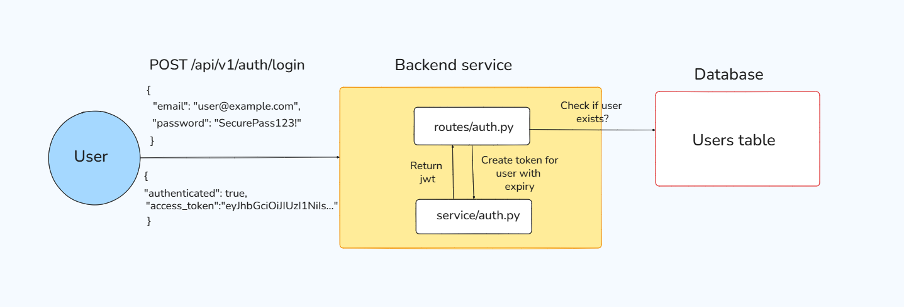
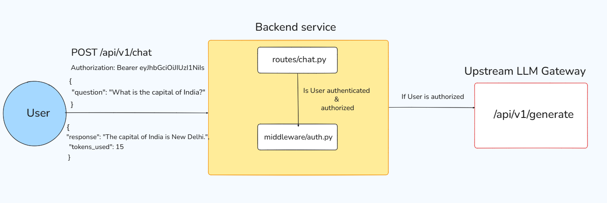
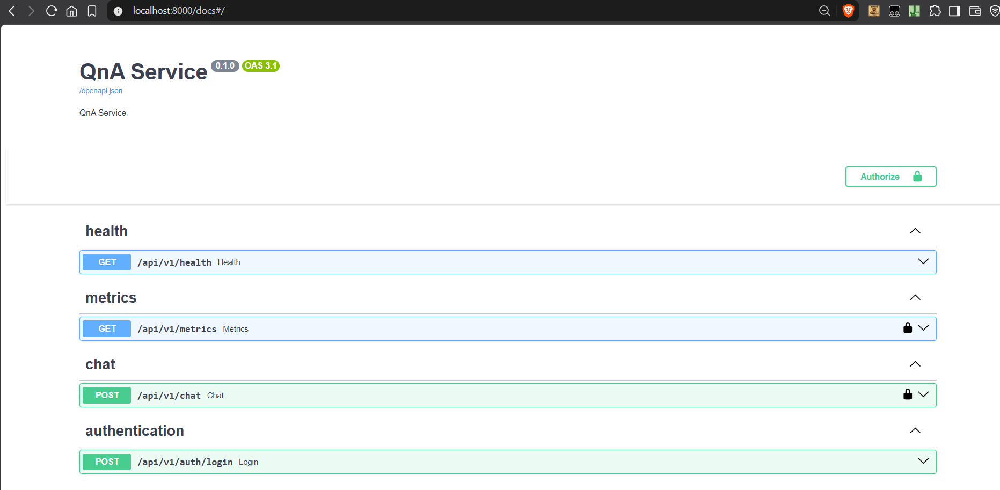

# Backend Microservice
This service acts as an API gateway, handling user authentication via `/auth/login`, request routing to upstream LLM services via `/chat`, and monitoring via `/metrics` endpoints.

## Setup (via Docker)

1. Create `.env` file in backend by referring to `.env.example`

2. Ensure `Database` and `Generation` service are up and running

3. Build docker image of Backend service
```bash
docker build -t backend-service .
```

4. Run backend container service
```bash
docker run --name backend -p 8000:8000 --env-file .env backend-service
```

**NOTE**: For production, we should avoid writing API keys in .env files and loading as environment varialbes because they get reflected in `docker inspect`. We will be either using "secret mounts" or provide API keys at runtime from Secret management tool like AWS Secret manager (for this we would need to make code changes)


## Architecture

### File Structure
<details>
<summary>File Structure</summary>
<br>

```
backend/
├── main.py                 # FastAPI application entry point
├── middleware/
│   ├── __init__.py        
│   └── auth.py            # JWT authentication middleware
├── models/
│   ├── __init__.py        
│   ├── users.py           # User database model
│   ├── login.py           # Login request/response models
│   ├── chat.py            # Chat request/response models
│   └── metrics.py         # Metrics response model
├── routes/
│   ├── __init__.py        
│   ├── auth.py            # Authentication endpoints
│   ├── chat.py            # Chat endpoint
│   ├── metrics.py         # Metrics endpoint
│   └── health.py          # Health check endpoint
├── services/
│   ├── __init__.py        
│   ├── database.py        # Database connection
│   ├── auth.py            # JWT token creation service
│   └── metrics.py         # Metrics storage and calculation
└── scripts/
    ├── __init__.py        
    └── seed_users.py      # Database seeding script
```

</details>

### User Request Flow

#### Authentication Service



1. User sends credentials to `/api/v1/auth/login`
2. Request is received by `/auth/login` which checks if email exists and if so then matches user's password with hashed password stored in database.
3. If valid, payload containing user role and user email goes to `Service` layer which generates a time-based (1 hour) JWT token.
4. This token is returned to user for authentication to secured APIs  


#### Chat Service



1. User sends question request to `/api/v1/chat` along with authorization token
2. Authorization token is verified using `get_current_user` method defined by middleware to check authentication and authorization. If payload is missing or invalid, "Not authenticated" response is sent back.
3. User's question is then forwared to upstream LLM service on `/api/v1/generate`
4. Response from LLM is then returned back to the user along with total tokens (input + output) used.


## API Endpoints



### Authentication

#### POST `/api/v1/auth/login`
Authenticate user and receive JWT token.

**Request Body:**
```json
{
  "email": "user@example.com",
  "password": "SecurePass123!"
}
```

**Response:**
```json
{
  "authenticated": true,
  "token": "eyJhbGciOiJIUzI1NiIsInR5cCI6IkpXVCJ9..."
}
```
<hr>

### Chat

#### POST `/api/v1/chat`
Process user question and return LLM-generated response.

**Headers:**
```
Authorization: Bearer <your_jwt_token>
```

**Request Body:**
```json
{
  "question": "What is the capital of India?"
}
```

**Response:**
```json
{
  "response": "The capital of India is New Delhi.",
  "tokens_used": 15
}
```
<hr>

### Metrics

#### GET `/api/v1/metrics`
Retrieve metrics (Admin only).

**Headers:**
```
Authorization: Bearer <admin_jwt_token>
```

**Response:**
```json
{
  "routes": {
    "/api/v1/chat": {
      "requests": 150,
      "errors": 5,
      "average_latency_ms": 234.56
    },
    "/api/v1/auth/login": {
      "requests": 75,
      "errors": 2,
      "average_latency_ms": 45.12
    }
  }
}
```
<hr>

### Health Check

#### GET `/api/v1/health`
Check service health status.

**Response:**
```json
{
  "status": "healthy"
}
```