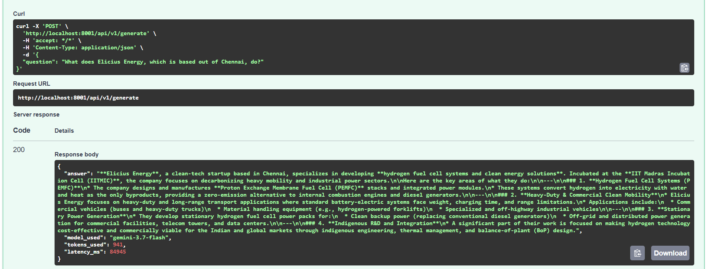

# Generation (LLM Gateway) Microservice

Generation microservice provides interface for LLM providers as upstream LLM service for backend microservice which `/chat` route calls.



## Setup Instructions (via Docker)

1. Create `.env` file in generation directory by referring to `.env.example`

2. Build docker image of Generation service
```bash
docker build -t generation-service .
```

3. Run backend container service
```bash
docker run --name generation -p 8001:8001 --env-file .env generation-service
```

## Architecture Overview

```
Client → QnA Backend (/chat) → LLM Gateway → Gemini/OpenAI API
                              ↓
                        Health Endpoint
                        Generate Endpoint  
                        Metrics Middleware
```

## API Endpoints

### Health Check
```bash
GET /api/v1/health
Response: { "status": "ok", "provider": "openai", "model": "gpt-4" }
```

### Generate Response
`POST /api/v1/generate`

```bash
curl -X POST http://localhost:8001/api/v1/generate \
  -H "Content-Type: application/json" \
  -d '{
    "question": "What is the capital of India?"
  }'
```

### Response

```json
{
  "answer": "The capital of India is New Delhi.",
  "model_used": "gemini-3-preview",
  "tokens_used": 25,
  "latency_ms": 1234
}
```

## Project Structure

<details>
<summary>File Structure</summary>
<hr>

```
generation/
├── main.py                # FastAPI application entry point
├── requirements.txt       # Python dependencies
├── .env.example           # Environment variables template
├── Dockerfile             # Container configuration
├── README.md              # This file
├── models/
│   ├── __init__.py
│   └── requests.py        # API request/response models
├── routes/
│   ├── __init__.py
│   ├── generate.py        # Main generation endpoint
│   └── health.py          # Health check
├── services/
│   ├── __init__.py
│   └── providers/
│       ├── __init__.py
│       ├── gemini.py       # Gemini implementation
│       └── register.py     # Registers LLM provider
└── middleware/
    ├── __init__.py
    └── metrics.py         # Request tracking and latency
```
</details>